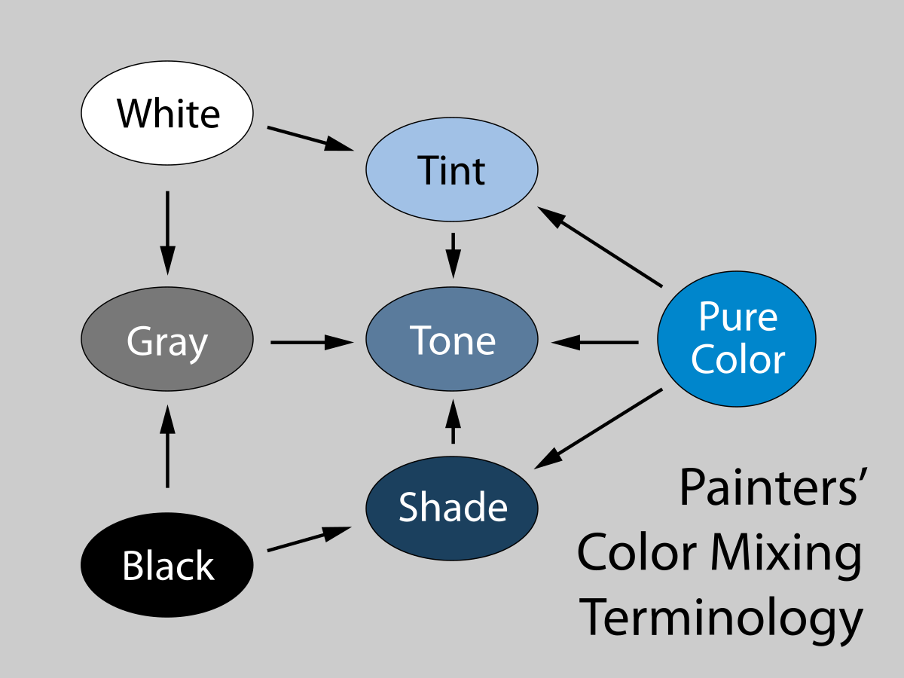

# BulbCode

BulbCode是音箱网关使用的独立协议，用于控制灯的效果；不要和BulbBoot或BulbCast混淆。

| Protocol | 用途                                                     | magic    | 命令                                                         |
| -------- | -------------------------------------------------------- | -------- | ------------------------------------------------------------ |
| BulbBoot | 音箱网关用于控制基础固件（第一级）的指令                 | b01bb007 | blink, boot                                                  |
| BulbCode | 音箱网关用于控制功能固件（第二级）的指令                 | b01bc0de | 16bit encoded command                                        |
| BulbCast | 灯泡的广播，目前第一级有详细定义和实现，第二级需逐步完善 | b01bca57 | device info, aged time, temperature, illumination, lastwill etc. |


## 修改历史

2022-01-10, ma，调整`1000`和`1002`指令的内容顺序，将`Fade in Duration`调整到色彩之前；


## 格式

和BulbBoot一样，BulbCode实际上是使用ble advertisement packet中manufacturer data的最大26字节payload的数据发送。开发者只关心这26个字节即可，使用hex code格式加`\n`结尾发送给thin modem即可。

| magic (4 bytes) | seq (1 byte) | group id (4 bytes) | bit mask (2 bytes) | command (2 bytes) | payload (13 bytes)         |
| --------------- | ------------ | ------------------ | ------------------ | ----------------- | -------------------------- |
| b0 1b c0 de     | 00-0f        | a0 a1 a2 a3        | ff ff              | 0001              | 00000000000000000000000000 |

说明：

1. 包长永远是26字节；蓝牙数据包有整包校验，无需额外添加校验；
2. `seq` (sequence number)不用于事务（transaction）或维护顺序（out-of-order），但需要一直变化，不然若连续两个命令payload完全相同，第二个命令可能被接收者的底层过滤掉；
3. ~~与`bulbboot`命令不同，`bulbcode`的seq的最高4个bit为保留bit，未来可能用于变更bit mask长度；所以seq目前实际上在`00-0f`的取值范围内；也基于此，payload可能**仅有11字节**的可用空间；~~
4. `group id`定义和`bulbboot`命令一致，是组id；`bulbcode`实际上是纯组播（multicast）协议，仅有组播功能，无单播（unicast）功能；
5. bit mask掩码覆盖的设备都应该执行此包的命令；
   1. 例如：网关在boot阶段依次向两个不同设备发送了`bulbboot`指令，`boot_params`分别为`b0b1b2b30201`和`b0b1b2b30204`，则这两个设备均属于`b0b1b2b3`组，掩码分别为`0002`和`0010`，如果一个bulbcode指令的group id + bit mask为`b0b1b2b30012`，则这两个设备都应该执行该命令；
   2. 如果设计就是几个灯在一个场景里的动作永远一致，它们可以使用同一个掩码；例如摆放在角落外围的气氛灯可以有一样的指令；如果指令约定的行为具有随机性『差异』，即使使用同样掩码仍可获得随机不同效果；


## 模型

**本章内容仅做讨论，未实际实现，当前的实现事实上仅包含一层，混合了本节所述的1/2/3层功能，开发者可跳过本章内容。**

初步构想的混色和含时控制的模型是叠层逻辑，包括：

1. 基础颜色层，设置一个或者多个基础颜色，主要是考虑Hue；
2. 颜色变化层，对基础颜色做变化，该层负责变化方式，变化周期性，Hue和Saturation的变化幅度；
   1. 该层可以完全override基础颜色层的saturation设置（而不是混合），但原则上不该override基础颜色层的hue；
   2. 随机和同步设计见后面的讨论；
3. 亮度变化层，亮度变化层在颜色变化层之上；
   1. 亮度层可以是亮度开关（shutter），周期变化的透明度，
   2. 亮度变化层可以直接使用颜色变化层的周期，可以制造固定或随机的相位差；
4. 保留的中间层；目前不定义行为；
5. 音符层，类似打击乐的噪音或者音符；
   1. 一个『音符』包含颜色，亮度可以是一段短促的噪音振荡，或者ADSR包络（attack-decay-sustain-release envelope）；它叠加在其他层之上，且最终一定结束； 
   2. 原则上音符的数量不做限制，允许叠加；实际上不会同时叠加大量音符，灯光不是乐器具有音色而且人可以分离；例如鼓声和钢琴声同时出现，人可以分离；但红色和蓝色同时出现，人只会看到紫色；但设备可以以100ms的时间精度构成任意闪烁的Pattern，每次闪烁有不同的时间长度和强度变化，
   3. 例子：脉冲，爆闪，匹配噪音的脉冲叠加，例如雷声刀剑声，匹配音乐节奏，较为适合使用音符层实现。


以上设计尚处于摸索阶段，开发者尽最大可能保证设计一致性，但无法完全保证，如果有特殊效果已有设计无法完成而用户需要，必要的设计变更还是得有。


### 量感，随机，同步等

此段落描述一些开放的想法。

1. 量感在视觉上永远是重要的，4只亮度为1/4的灯一起工作，可以表现的效果远好于1只亮度为1的灯；
2. 灯的颜色只有在肉眼可以直接观察的时候才有颜色的解析力，而对于LED灯泡而言这是很低的亮度，在日常室内有自然光照明时，灯泡仅能看出是在发光的，谈不上明亮，也远不够照明；但是达到照明亮度的彩色灯，仅能用于短暂制造效果，无法有更好的表现力，也不适合表现环境背景，层次，质感，流动性，细微到观察力极限，仅注意观察才能看出的缓慢变化，而这些对于表现氛围是重要的；
3. 即使没有规则的几何摆放，随机堆在一起的一组灯，其中的一两个的变化仍然可以和其它灯构成前景事件和背景幕布的对比；
4. 堆在一起的一组灯，可以在色调，饱和度和亮度上都有细微的区别，可以有不同的变化周期，包括持续或连续的变化，或轻微的跃变；
5. 有量感就可以有随机性，制造层次和质感，避免单调；为避免编程的繁琐（通过连续大量命令逐一通知灯泡变化颜色亮度），可以让一组灯在一条设定颜色周期性变化的指令里，给出色调随机变化幅度，亮度随机变化的幅度，周期的随机变化幅度，以及具有随机性的启动等待时间，实现混杂效果；
6. 精确的同步单调的但富有力量感；使用相同的周期但错开启动时间实现相位（phase）差，可产生同步且错落有致的感受（层次）；
7. 在上述层的设计里，预期是每一层的逻辑能拿到底层的基础属性，例如颜色变化层可以知道基础颜色层有几个颜色；亮度变化层能知道颜色变化层当前在使用何种周期，上层可以选择是否和下层同步，或错开相位制造交错，比如亮度层可以让Hue在一段弧线AB上摆动时，A端亮B端暗，或者相反；但层的设计里下层不了解上层的行为；


## 色彩空间

开发者需要理解灯泡的色彩和我们在屏幕上看到的RGB色彩空间不同。


（绘画的）颜色混色是从饱和度最高的纯色开始，添加白色，灰色，和黑色，分别称为tint，tone，shade (or shadow)，形成其它颜色，如下图所示。




虽然屏幕上显示的RGB颜色不一定由绘画混色的方式选出，但是它们的色彩和亮度空间基本一致，尤其是亮度不高的颜色，例如暗红，棕色，墨绿，深蓝等等是可以表达出来的。但是对于灯泡来说这通常不可能，尤其是不含有蓝色成份的颜色（因为人眼感知到的蓝色很暗）。造成这种情况的原因是缺乏『黑色』混入，灯泡本身有颜色，在有光照的情况下它的diffuser的反射率还不低，一般电子纸的反射率就是50-75%的范围，灯泡大致在这个范围，所以在正常光线照明下如果不上电，灯泡的外观是白色的，同时环境也不是黑的。只有在大面积黑色背景，较低环境照明情况下，远距离看，存在混出暗色的可能，这个环境照明还不能完全没有，因为人眼会自动调节进光量，如果环境照度太低，人眼会增加进光量提高视觉亮度，结果是仍然看不到暗的颜色。


最初的色彩空间实现采用了FastLED的HSV到RGB的色彩转换函数，但当前实现抛弃了这个转换，因为灯泡的亮度动态范围太大，人眼对亮度感知明显是指数定律生效，而不是显示屏幕上的线性空间。最终的HSV到RGBW函数是自己写的，根据物理学计算，对亮度感知有对数修正，体现在颜色渐变时有很好的线性度，即用户**感受到亮度的变化是线性的**，但其实是在指数变化；硬件平台提供了最高13bit的动态范围，实际用到12bit，即PWM的duty cycle是4096级，而不是256级。


但颜色的主观感受很难做到完美，有这样几个因素影响：

1. RGB只是能模拟太阳光谱颜色感知，并不完全一致，这个差别人是能感受到的，自然光（太阳光谱）给人的感受是丰富和饱满，RGB的颜色则是鲜艳但是单薄的；
2. 硬件RGB颜色的波长一致性是可以的，但是不是完全准确的，比如不同器件的红光的实际峰值和半高宽不一样，这影响色准；
3. 心理感知和物理亮度不同，这一点在颜色循环（0x1004指令）时感受很明显，有卡顿感，因为蓝色区域的心理感知亮度是很低的，所以虽然是颜色循环，实际感知是亮度也在周期变化，而不是显示器上的那种均匀。这里很难做补偿，除非是针对这个单一指令去调节心理亮度。相对于灯泡，屏幕显示的RGB的动态范围太小了，就是它整个的亮度变化都在很低的水平，低到人不大感受到色彩循环时亮度有明显变化。
4. 除了爆闪指令（0x1005）之外，其它指令使用统一的HSV色彩空间，它包括HSV->RGB的转换函数和归一化亮度都是一致的，而不是每命令不同；白色是通过白色LED混入的（冷白暖白占空比比例4:1，不是亮度4:1，亮度4:1要用仪器去校准才行），这样做一是白色比较准，其次功耗有收益；这种混色方式拓展了可用的饱和度范围，否则仅高饱和颜色可用，低饱和度的颜色分辨率很低。
4. 色谱占比是另一个心理感知问题。比如按照红黄绿青蓝紫的色调定义匀速循环颜色时，人会感觉黄色的部分太少了，所以口语上说红橙黄绿青蓝紫的时候感觉是7色均匀而不是6色，这事实上『膨胀』了橙色和黄色区域的占比。FastLED对此有补偿设计，它的色谱就分为rainbow色谱和标准色谱。但改成rainbow色谱会让整个色彩空间发生形变，所以目前仍然仅使用标准色彩空间。这个占比问题以`0x1004`指令的感受最为明显。


综上，关于色彩的『科学』其实难称科学，感知和物理的差别很大，线性度也不佳，很多变换需要非线性的补偿；项目中只能尽力而为的修补一些明显问题，准确的色彩实现且符合感知需要大量的仪器测试和修正工作，因此建议应用开发者多使用变化和随机分布的差异效果构造丰富和饱满的视觉感受，减少单调控制，在非冲击性效果上，单调的色彩因为低色域空间、色彩准确度不佳、未修正和符合心理感知的占比，可能体验并不好。


原则上除了爆闪之外所有颜色都用HSV指定，这样色彩有尽力而为的一致性。爆闪指令是突破了色彩空间的，因为它强调冲击力，使用最大亮度实现。HSV的数据格式说明在`0x1002`指令中。


## 码表

以下编码中如果整数类型超过1字节长度，均使用Most Significant Byte在前面的字节序。例如`(uint16_t)255`是`00 ff`，不是`ff 00`。


编码空间为`uint16_t`，共`65536`，实际上因分层合成模式的使用，远远用不到这样的编码空间。预计的编码分配方式如下（目前实际实现仅有1000中的很少的几个指令）：

| 范围      | 分配                           |
| --------- | ------------------------------ |
| 0000~0fff | 基础设置，如果有的话           |
| 1000~1fff | 基础颜色层                     |
| 2000~2fff | 颜色变化层                     |
| 3000~3fff | 亮度变化层                     |
| 8000~8fff | 音符层                         |
| ff00~ffff | 开发者使用，不要在生产环境使用 |


### 0x1000 primary color fade in, RGB (0-255 for each color)

**此命令未实现，请跳过本节内容**

本命令使用RGB设置基础色中的主色，支持过渡。

使用RGB色彩空间，但RGB色彩空间主要是给测使用，使用网页上或工具软件里得到的RGB色彩从本命令设置色彩，只有高饱和度低亮度的部分色彩是可用的，RGB色彩空间中95%以上的色彩都无法使用。

Fade in Duration是过渡时间，是过渡到所设置色彩的过渡时间，本命令使用RGB空间的线性过渡；不保持颜色饱和度，也不经过white-out（经白色的过渡）和black-out（经黑色的过渡），如果有这方面的需求请联系开发者。

| code (2 bytes) | option bits (1 bytes) | Fade in Duration (2 bytes, MSB) | RGB (3 bytes) | Reserved (7 bytes) |
| -------------- | --------------------- | ------------------------------- | ------------- | ------------------ |
| `1000`         | `00`                  | `0000`                          | `rrggbb`      | `000000000000`     |

| option bits | bit mask | 含义                                                         |
| ----------- | -------- | ------------------------------------------------------------ |
| `00000001b` | (1 << 0) | 如果设置，duration以秒为单位，如果未设置，duration以100毫秒为单位，如果duration为0则无过渡。 |
| `01111110b` | -        | reserved，请设置为0。                                        |

补充：

1. 使用本命令并设置RGB均为0可以完全关闭发光。


### 0x1002 primary color fade in, HSV (H: 0-255, S: 0-255, V: 0-255)

本命令使用~~FastLED~~ HSV设置基础色中的主色，支持过渡。

HSV的取值范围0-255整数，数据类型`uint8_t`；注意这与一般的HSV编码不同，最常见的HSV编码，三者都是float或double类型，其中H取值范围0-360，饱和度和亮度都是0-100。其对照如下：

| -            | Standard HSV | Custom HSV                        |
| ------------ | ------------ | --------------------------------- |
| 色彩         | 0-360.0      | 0-256 (注意360度对应256而不是255) |
| 饱和度或亮度 | 0-100.0      | 0-255（注意最大值是255，不是256） |

使用本命令时的色彩过渡采用HSV空间的渐变过渡，视觉上最显著的变化是Hue的连续变化，例如从red到green会经过yellow，而不是从RGB空间里的“灰块”里穿过去。HSV色彩符合创作者直觉且HSV空间的饱和色过渡色彩丰富，推荐开发者在设置主色时仅使用该方法。

| code (2 bytes) | option bits (1 bytes) | Fade in Duration (2 bytes, MSB) | HSV (3 bytes) | Reserved (7 bytes) |
| -------------- | --------------------- | ------------------------------- | ------------- | ------------------ |
| `1002`         | `00`                  | `0000`                          | `hhssvv`      | `00000000000000`   |

| option bits | bit mask | 含义                                                         |
| ----------- | -------- | ------------------------------------------------------------ |
| `00000001b` | (1 << 0) | 如果设置，duration以秒为单位，如果未设置，duration以100毫秒为单位，如果duration为0则无过渡。 |
| `00000010b` | (1 << 1) | 0: 自动选择色调的短弧线做颜色过渡；1: 手动指定色调过渡弧线。 |
| `00000100b` | (1 << 2) | 在手动指定色调过渡弧线的前提下，0使用顺时针，1使用逆时针；顺时针指red-yellow-green-teal-blue-purple这个顺序。 |
| `11111000b` | -        | reserved，请设置为0。                                        |

使用本命令并设置HSV中的V为0可以完全关闭发光，和RGB命令不同这种关闭保留了色调和饱和度设置，在下一次设置时从保留的色调和饱和度开始fade-in渐变，而不是从“灰白”的低亮度开始。

#### 例子1 无过渡直接指定颜色

直接指定红色，最大亮度和饱和度：

```
# magic    seq groupId  bits  code opt duration hsv    padding
# b01bc0de 00  a5a5a5a5 ffff  1002 00  0000     00ffff 00000000000000
```


#### 例子2 从当前颜色渐变至指定颜色

```
# 
# magic    seq groupId  bits  code opt duration hsv    padding
  b01bc0de 00  a5a5a5a5 0001  1002 00  0020     88ff33 00000000000000
```

### 0x1003 random trapezoid

| code (2 bytes) | payload (13 bytes)           |
| -------------- | ---------------------------- |
| `1003`         | `xxxxxxxxxxxxxxxxxxxxxxxxxx` |

| No | name  | example | comment 
| -- | ----- | ----    | ------- 
| 0  | opt0  | `00`    | 目前固定为0 
| 1  | opt1  | `00`    | 目前固定为0 
| 2  | opt2  | `00`    | 目前固定为0 
| 3  | cycle | `10`    | 周期，单位为秒，`10`为16秒周期
| 4  | bot   | `88`    | 梯形的底**相对于周期的比例**的最大值和最小值，max/min格式（见注释），`88`指最大值和最小值都是周期的8/15长度
| 5  | top   | `88`    | 梯形的顶**相对于底的比例**的最大值和最小值，max/min格式，`88`指最大值和最小值都是底的时间长度的8/15
| 6  | up    | `88`    | 梯形的上升沿**相对于上升沿和下降沿之和（即底的长度减去顶的长度）的占比**的最大值和最小值，max/min格式，`88`指上升沿占上升沿和下降沿之和的8/15，即下降沿占了另外的7/15，基本上相当于两者相等，人眼无法分出1/15的差异
| 7  | hue1  | `88`    | 第一个点的色调值，max/min格式，`88`指最大和最小的色调值都是8，相当于360度色调里的8 / 15 * 360 = 192
| 8  | sat1  | `88`    | 第一个点的饱和度，max/min格式，`88`指最大和最小的饱和度都是8，相当于8 / 15 x 100% = 53.3%  
| 9  | val1  | `88`    | 第一个点和亮度，max/min格式，`88`指最大和最小的亮度都是53.3%
| 10 | hue2  | `88`    | 同hue1
| 11 | sat2  | `88`    | 同sat1
| 12 | val2  | `88`    | 同val1

说明：
- max/min格式紧凑的使用一个byte表示『差异』，差异的意思是收到该指令的每个灯自己随机产生一个在最大（max）和最小（min）值之间的值作为自己的参数，且随机性是每周期调整的；
- max/min使用高4位表示max值，低4位表示min值，精度不高，取值范围仅0-15，但无论时域还是色彩，在周期性变化下无法分辨出更高的精度；
- 因为以1/15为单位，除了0/15（`0`）和15/15（`f`）其它值都不是较为规则的分数比例；比如50%只能在7或者8之间选择一个；

#### 例子1：指定颜色，亮度周期从0至最大值渐变（上升）

`b01bc0de00a5a5a5a5ffff100300000002ff00ff00ff0000ffff`

`a5a5a5a5`是group id, `ffff`掩码，`1003`命令，`000000`保留的option bytes，`02`是2秒周期，`ff00ff`指底是周期的100%，顶为0，上升沿是底（也就是周期）的100%，这样下降沿就是0%，时域上这个编码产生的是正锯齿波，对应当前需求里的颜色渐变的变亮；起点和终点的颜色分别是`00ff00`和`00ffff`，即饱和度100%的红色，一个亮度是0，一个亮度是最大值。

#### 例子2：指定颜色，亮度周期从0至最大值渐变（下降）

方法1：把起点颜色和终点颜色对掉一下：

`b01bc0de00a5a5a5a5ffff100300000002ff00ff00ffff00ff00`

方法2：把正锯齿波的`ff00ff`修改为`ff0000`，即上升沿为0，下降沿占满周期。效果一样。

`b01bc0de00a5a5a5a5ffff100300000002ff000000ff0000ffff`

#### 例子3：指定颜色，呼吸

呼吸实际上是完全使用了梯形的四个阶段的，其特征是：
- 需要有上升沿和下降沿，且下降沿比上升沿比例略高，即呼气时间比吸气时间略长；
- 需要有顶部，可以不多但不能太少，这个是短暂的屏气；
- 梯形底部占整个周期的大部分时间，不然每次呼吸之间的间隔太久感觉会有点奇怪（断气了？）；
- 周期要长一点，表达舒缓的感觉，建议6-8秒；

例如：

`b01bc0de00a5a5a5a5ffff100300000008dd336600ff0000ffff`

其中时域设置为`08dd2266`，周期8秒，底部占周期比13/15，顶部占底部比3/15，上升沿占上升下降之和比例为6/15，即呼气是9/15，是吸气时间的1.5倍。

上面的例子是最低亮度为0的，也可以试一下最低亮度不为0的。

`b01bc0de00a5a5a5a5ffff100300000008dd336600ff1100ffff`

----


